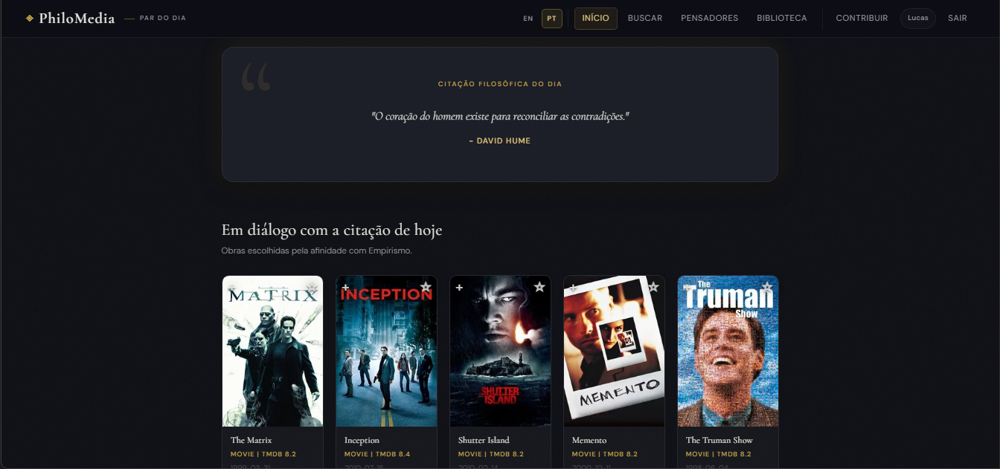

# PhiloMedia

> Discover films and series through the lens of philosophy — with AI-powered interpretations.



🔗 **[Live Demo](https://philomedia.onrender.com/)** &nbsp;|&nbsp; 📖 **[API Docs (Swagger)](https://philomedia.onrender.com/api-docs)**

---


---

## About

PhiloMedia connects films and TV series to philosophical quotes, offering users a unique lens to reflect on the media they consume. Browse featured works, search the TMDB catalog, and receive a curated philosophical quote paired with an AI-generated interpretation — available in **English** and **Brazilian Portuguese**.

## User Flow

1. Search for a movie or series
2. Open its details page
3. Read a resonant philosophical quote
4. Receive an AI-generated interpretation tailored to that title

## Tech Stack

| Layer | Technology |
|---|---|
| **Frontend** | HTML, CSS, Vanilla JavaScript |
| **Backend** | Node.js, Express |
| **Database** | MongoDB + Mongoose |
| **AI** | Google Gemini API |
| **Auth** | Passport.js + Google OAuth |
| **External API** | TMDB |
| **Docs** | Swagger UI |
| **Deployment** | Render |

## Key Features

- **Internationalization (i18n):** Language selection (EN/PT) persists via `localStorage`. Translations cover UI strings, TMDB metadata, quote catalogs, and philosopher biographies.
- **AI Interpretation:** Google Gemini generates contextual readings for each title. Includes automatic model fallback (`gemini-2.5-flash` → `gemini-2.0-flash-lite` → `gemini-1.5-flash`) to handle rate limits gracefully.
- **User Library:** Google OAuth authentication with personal media collection support.
- **API Documentation:** Swagger UI at `/api-docs` in non-production environments.
- **Data Utilities:** Scripts for seeding quotes, importing Wikiquote datasets, and machine-translating content.

## Local Setup

```bash
# 1. Clone the repository
git clone https://github.com/Lucassilva027/philomedia.git
cd philomedia

# 2. Install dependencies
npm install

# 3. Configure environment variables
cp .env.example .env
# Fill in: MONGODB_URI, SESSION_SECRET, TMDB_API_KEY, GOOGLE_AI_API_KEY
# Optional: GOOGLE_CLIENT_ID, GOOGLE_CLIENT_SECRET, CORS_ORIGIN, PUBLIC_SITE_URL

# 4. Start development server
npm run dev
# App running at http://localhost:3000
```

## API Endpoints

| Method | Endpoint | Description |
|---|---|---|
| GET | `/health` | Process and database health check |
| GET | `/api/quotes` | Paginated quote retrieval |
| POST | `/api/ai/quotes/generate/media-context` | AI interpretation by `tmdbId` + `mediaType` |
| GET | `/api-docs` | Swagger documentation |

## Roadmap

- [ ] Discovery filters and genre-based browsing
- [ ] Improved metadata layout and editorial tooling
- [ ] Social sharing and community feedback
- [ ] Browser extension
